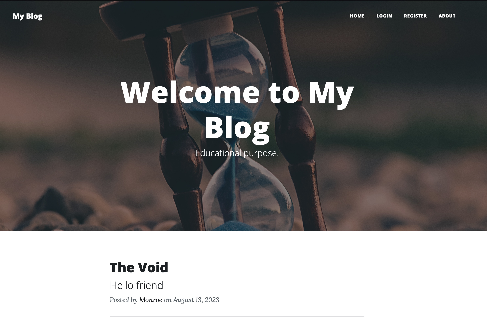
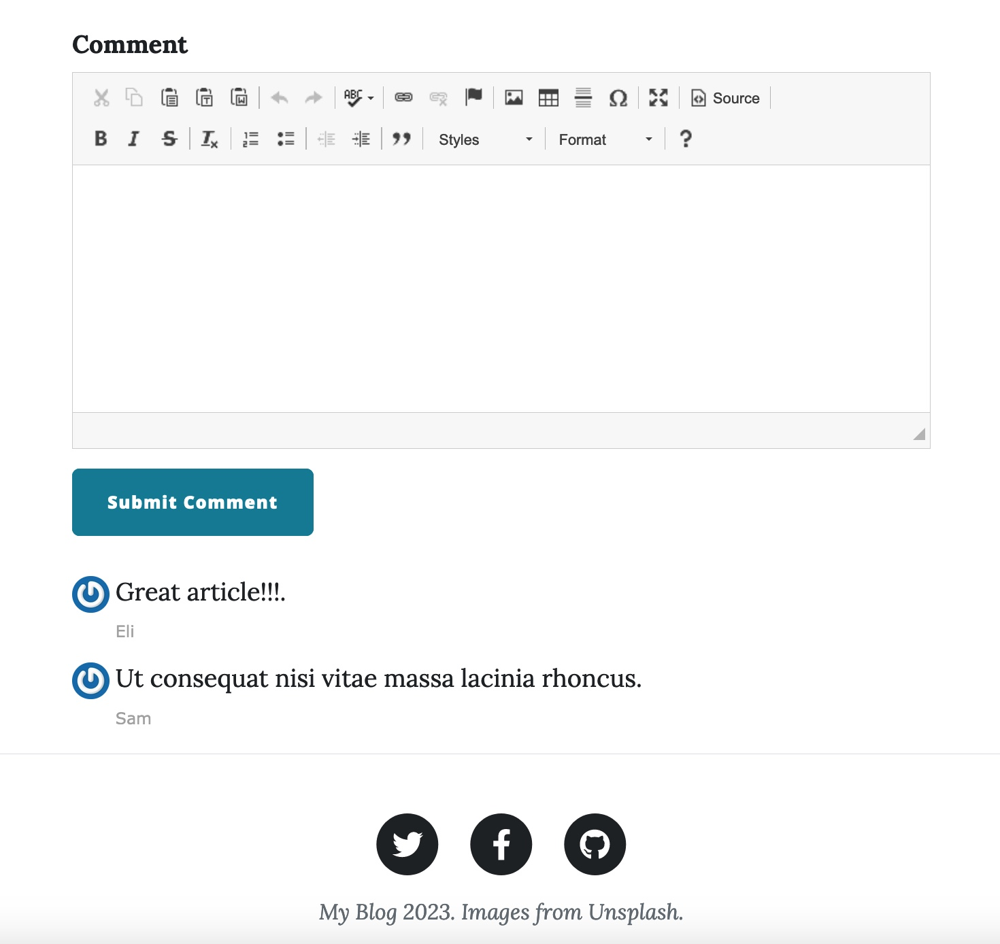

# Personal blog capstone project.

## Flask application with CRUD operations on blog posts. The data is stored in a SQLite database.

### Main page. The app allows one to register.

### Blog post.

### Only a registered user can comment on a blog entry.

### Only the owner can create a new blog entry.

