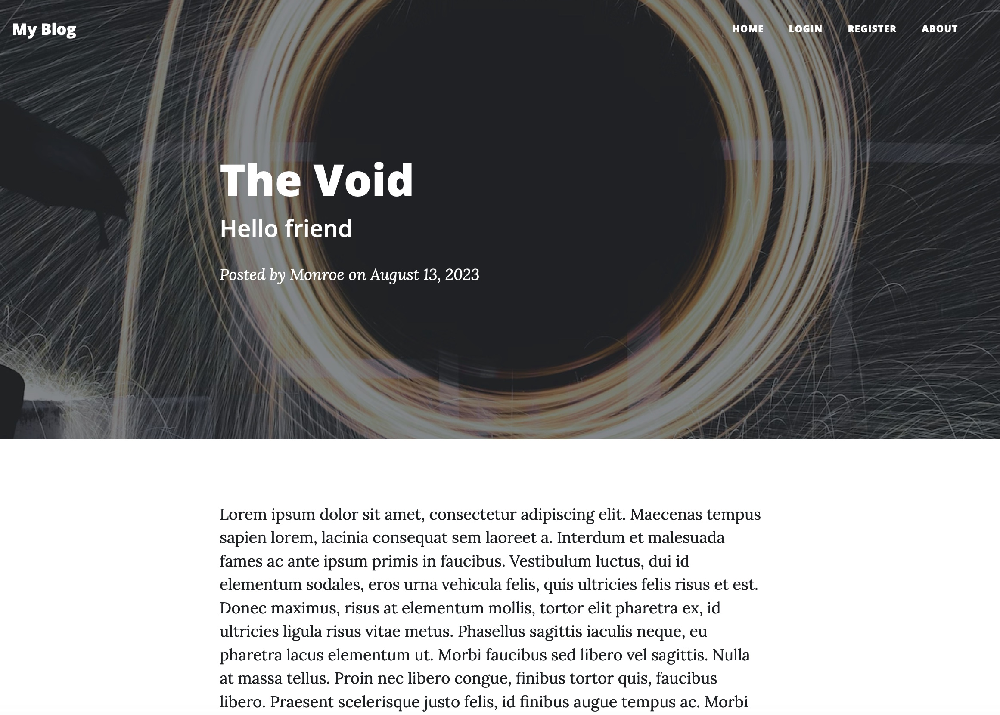
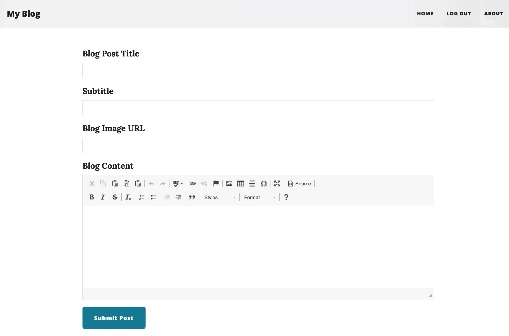

# Personal blog capstone project.

## Flask application with CRUD operations on blog posts. The data is stored in a SQLite database.

### Main page. The app allows one to register.

  

### Blog post.

  

### Only a registered user can comment on a blog entry.
  

### Only the owner can create a new blog entry.
  
